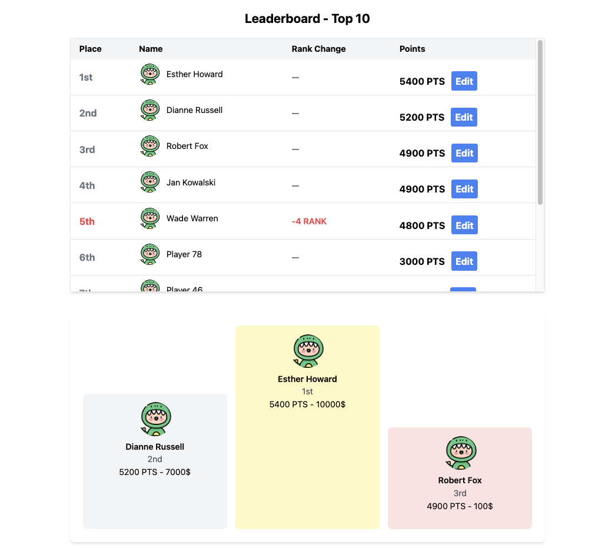
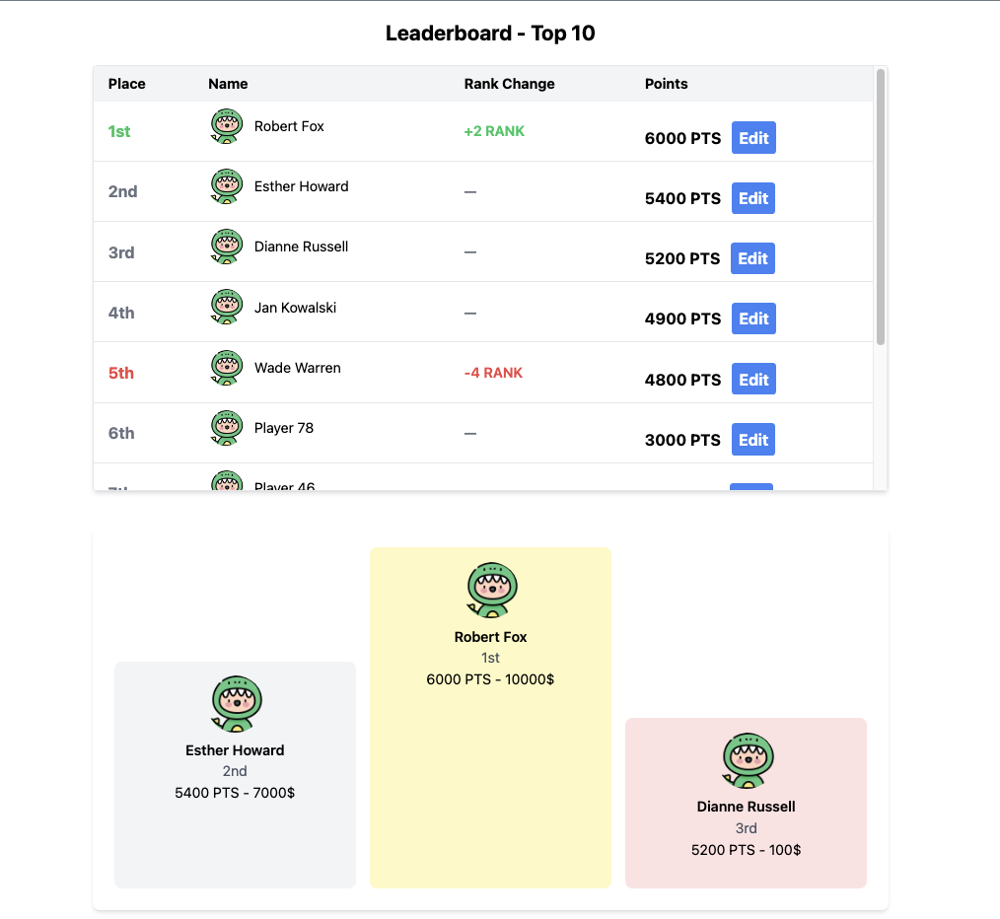
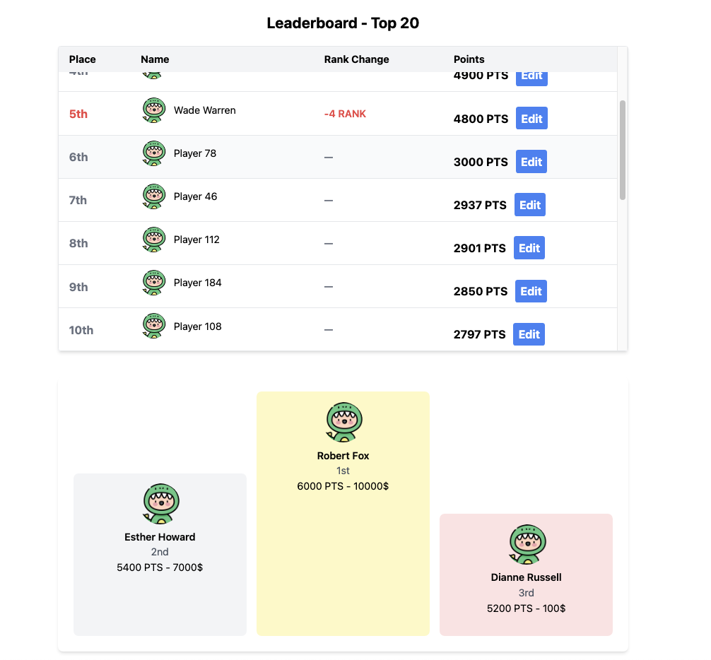
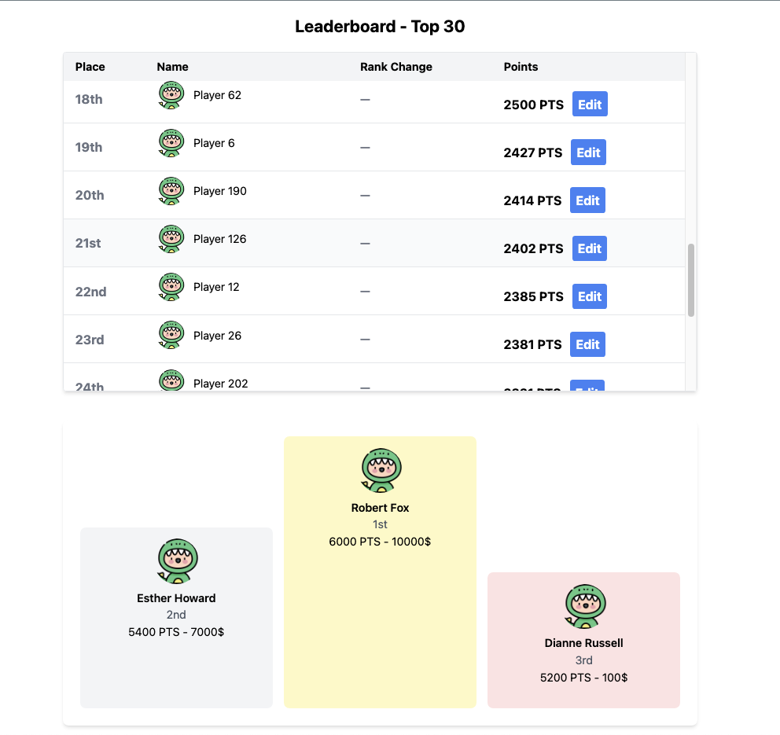

## Clone Project

```bash
https://github.com/nvkhuy/kingit-assignment.git
```

## Back-End
Move to back-end directory
```bash
cd back-end/leaderboard-app
```

To Install
```bash
go mod tidy
```

To Run
```bash
go run main.go
```
Back-End start on `localhost://8080`

## Front-End
Move to front-end directory
```bash
cd front-end/leaderboard-app
```

To Install
```bash
npm install
```

To Run
```bash
npm start
```
Front-End start on `localhost://3000`


[//]: <> (tree -L 4 -I 'static|node_modules')
## Code Structure
```
├── LICENSE
├── README.md
├── back-end
│   └── leaderboard-app
│       ├── common
│       ├── controller
│       ├── go.mod
│       ├── go.sum
│       ├── handler
│       ├── main.go
│       ├── middleware
│       ├── models
│       └── repo
└── front-end
    └── leaderboard-app
        ├── README.md
        ├── package-lock.json
        ├── package.json
        ├── postcss.config.js
        ├── public
        ├── src
        └── tailwind.config.js
```
## Tasks 
- [x] A backend that stores stat information for users

- [x] A way to set a stat for a specific user

- [x] A way to see who the top 3 users for the stat are

- [x] A way to see the list of the top 30 users for that stat

## API

### Paginate Rankings

Request
```curl
curl --location 'localhost:8080/users/rankings?page=1&limit=3'
```

Response
```resp
{
    "data": [
        {
            "id": "1",
            "name": "Wade Warren",
            "points": 6100,
            "reward": "10000$",
            "ranking": 1
        },
        {
            "id": "3",
            "name": "Esther Howard",
            "points": 5400,
            "reward": "7000$",
            "ranking": 2
        },
        {
            "id": "2",
            "name": "Dianne Russell",
            "points": 5200,
            "reward": "100$",
            "ranking": 3
        }
    ],
    "page": 1,
    "limit": 3,
    "total": 105
}
```

### Edit User Points

Request
```curl
curl --location --request PUT 'http://localhost:8080/users/1' \
--header 'Accept: */*' \
--header 'Accept-Language: en-US,en;q=0.9,vi;q=0.8,ru;q=0.7,zh-CN;q=0.6,zh;q=0.5' \
--header 'Connection: keep-alive' \
--header 'Content-Type: application/json' \
--header 'Origin: http://localhost:3000' \
--header 'Referer: http://localhost:3000/' \
--header 'Sec-Fetch-Dest: empty' \
--header 'Sec-Fetch-Mode: cors' \
--header 'Sec-Fetch-Site: same-site' \
--header 'User-Agent: Mozilla/5.0 (Macintosh; Intel Mac OS X 10_15_7) AppleWebKit/605.1.15 (KHTML, like Gecko) Version/16.0 Safari/605.1.15' \
--data '{
    "points": 5000
}'
```

Response
```resp
{
    "id": "1",
    "name": "Wade Warren",
    "points": 5000
}
```

## Leaderboard Page
> Browser: http://localhost:3000


> Click `Edit`to update Wade Warren Point from 6100 to 4800
- [x] Wade Warren Ranking is 5th after update 
- [x] Top 3 in Podium changed exclude Wade Warren



> Click `Edit`to update Robert Fox Point from 4900 to 6000
- [x] Robert Fox Ranking is 1st after update
- [x] Top 3 in Podium changed include Robert Fox



> Scroll reach limit 10 then change from top 10 to 20



> Scroll reach limit 20 then change from top 20 to 30
- [x] total user from backend is 105, when reach 105 it will stop requesting API for paginate more data

- 